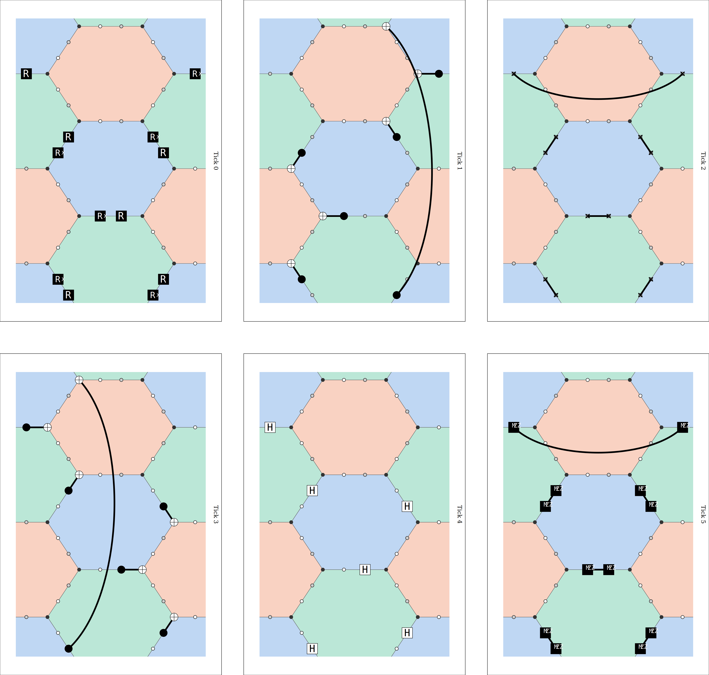
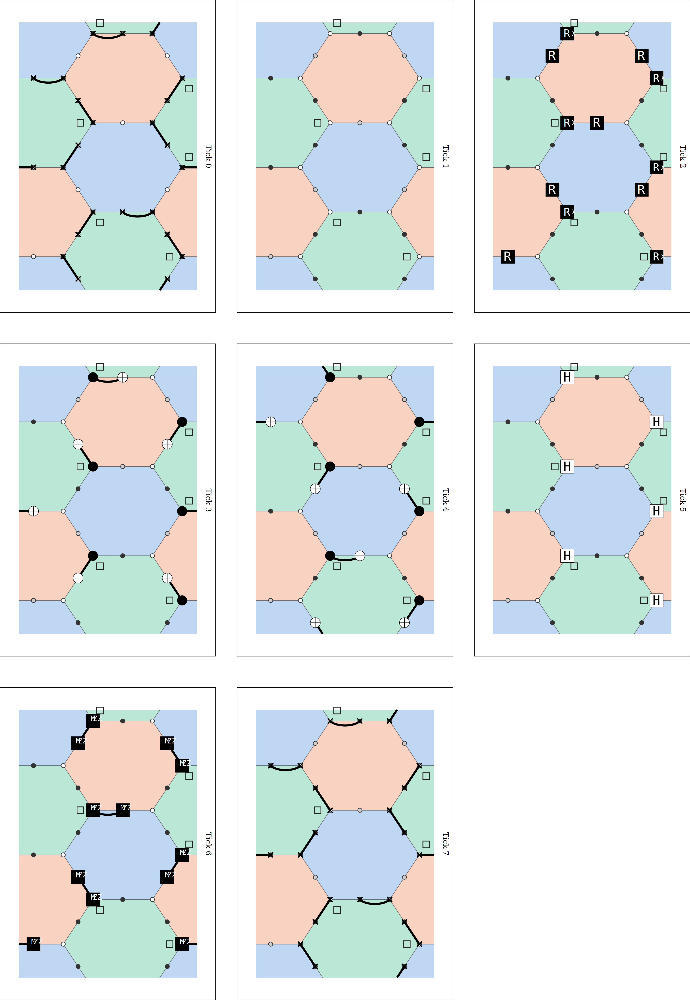
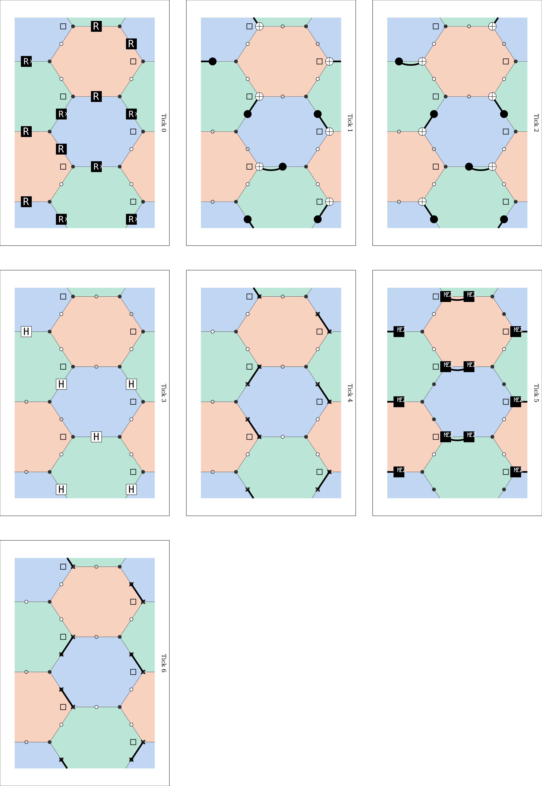
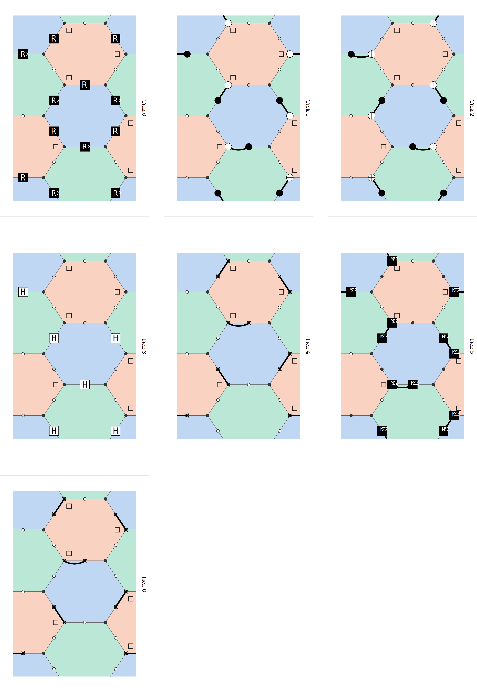

# Floquet honeycomb code with spin-qubit readout

Memory experiments for the Floquet honeycomb code, with readout through spin ancillas. The code compares
several readout schemes:

- **pairs**: a syndrome and a reference ancilla on every edge (`src/two_ancillas/`)
- **method_a / method_b / method_c**: one ancilla per edge, read out at a corner of a hex, following
  hexes.pdf (`src/single_ancilla/method_*/`)

Every scheme goes through the same `floquet.memory_circuit`, noise model and decoder (Stim + PyMatching), so the
only thing that differs between them is the step circuits.

Every scheme runs two codes, picked by `code=` in `memory_circuit` and each scheme's `round_circuit`:

- **css** (default): the CSS Floquet code, schedule `rX gZ bX rZ gX bZ`
- **x3z3**: the X³Z³ Floquet code (Setiawan & McLauchlan, arXiv:2411.04974), the CSS code with a Hadamard on
  every other column of data qubits. Checks become XX, ZZ, XZ or ZX and plaquettes X³Z³, so Z-biased noise
  is much easier to decode. See `notebooks/x3z3/x3z3.ipynb`.

Step 0 of each scheme at distance 1, one panel per tick (`make drawings`, hex view):

| pairs | method_a |
|---|---|
|  |  |
| **method_b** | **method_c** |
|  |  |

## Setup

```bash
make venv          # .venv with requirements.txt, plus a Jupyter kernel "floquet_code"
```

## Running

Every result is a `make` target. Settings can be overridden on the command line, and their defaults are
documented at the top of the [Makefile](Makefile).

| Target | What it makes |
|---|---|
| `make decode` | LER vs p for every scheme in `SCHEMES` (default: all four), in one CSV and one plot |
| `make plots` | LER vs p for the pairs scheme only, one CSV per distance |
| `make footprint` | LER vs physical qubit count at one `P`, extrapolated to `TARGET` |
| `make x3z3` | X³Z³ vs CSS Floquet code for every scheme under `NOISE`: threshold vs η, LER vs p, LER vs qubits |
| `make thresholds` | threshold surface and threshold vs bias for `SCHEME` (after IBM's QEC-with-spin-qubits); `CODE=x3z3` for X³Z³ |
| `make thresholds-all` | `thresholds` for every scheme; `thresholds-medium` / `thresholds-paper` with more shots |
| `make thresholds-x3z3` | `thresholds-all` for X³Z³; `thresholds-x3z3-medium` with more shots |
| `make drawings` | layouts and timeslices for every scheme at `DRAW_DISTANCE` |
| `make docs` | the LaTeX write-ups in `docs/` (needs tectonic) |
| `make serve` | interactive viewer of `results/` (needs node) |

Example:

```bash
make decode NOISE=MHBD ETA=100 DISTANCES="3 5 7" SHOTS=100000
```

Output file names include their settings, so runs with different settings don't overwrite each other.

## Layout

```
src/shared/           floquet.py (lattice, memory_circuit), noise.py (spin / HBD / MHBD), memory.py (decoding),
                      drawing.py (timeslice helpers): used by both schemes
src/two_ancillas/     pairs.py (step circuit), plots.py
src/single_ancilla/   shared/ (layout.py: one-ancilla lattice, corner_readout.py: corner readout used by B and C),
                      method_a|b|c/, decode.py, footprint.py, thresholds.py, x3z3.py (X³Z³ vs CSS sweep) + x3z3_plots.py
notebooks/            walkthroughs of each scheme, of the memory experiment and of the X³Z³ code
results/              all generated output, laid out like src/
docs/                 write-ups: floquet_rounds, decoding, spin_x3z3_readout, one_ancilla_review
viewer/               Vite + React viewer behind `make serve`
```
